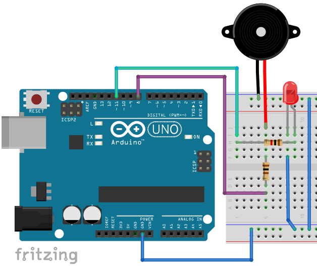
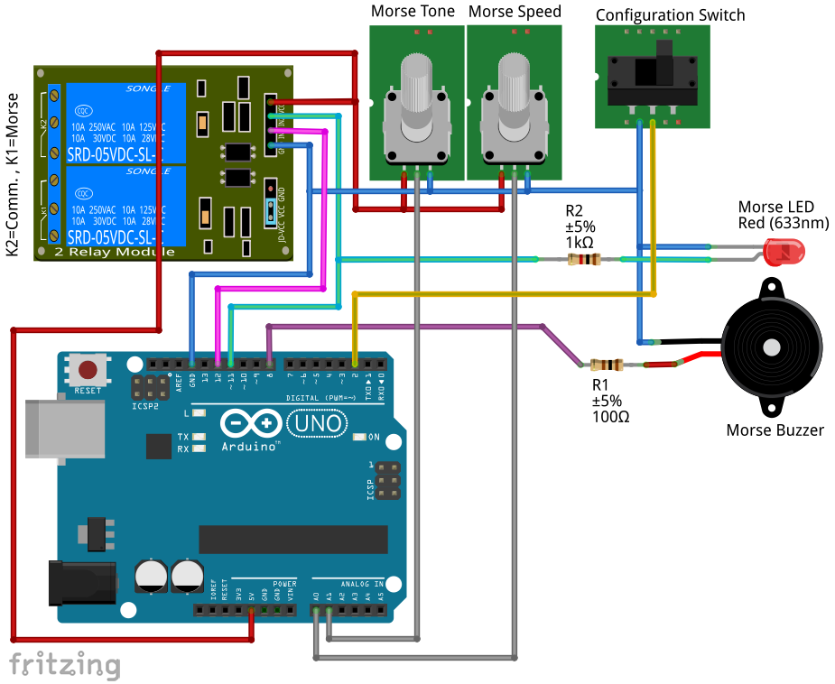

# MCHobby Arduino Morse Driver (piezo buzzer and digital output) #

This driver use the morse standard convention to generate audio and LED morse code.

Le library includes definition for ASCII letters but also for extended characters constant (outise of usual range) to predefine usual Morse messages like BEGIN_OF_TRANSMISSION, END_OF_TRANSMISSION, ERROR, OK, NEW_LINE, NEW_PAGE, NEW_PARAGRAPH, WAIT, BREAK, CLOSING, ATTENTION, END_OF_CONTACT, INVITE_NAMED_STATION (... to transmit), INVITE_ANY_STATION (... to transmit), SHIFT_WABUN_CODE, SOS 

The original code was designed to create an Morse emitter beacon.

## About this Driver ##

MCHobby invests time and resources providing this open source code.  Please support MCHobby and open-source by purchasing products from MCHobby @ [shop.mchobby.be](https://shop.mchobby.be)


Written by Meurisse D. for MC Hobby SPRL - [shop.mchobby.be](https://shop.mchobby.be)

## Morse Coding convention ##

The morse code follow this convention.
*  dotLen = time of the dot in milliseconds. 100ms by default.
*  dashLen = 3 x dot len
*  interDotLen    = dot len (it is the time between dot and dash when sending a charatacter in morse)
*  interLetterLen = 3 x dot len (it is the time between 2 characters when morsing a message)
*  interWordLen   = 5 x dot len (it is the time between 2 words when morsing a message)

The speed can be changed by calling the `morse_speed( dot_len_ms )` method.

## Samples ##

### ArduinoMorseTest ###
Here is the schematic for the `ArduinoMorseTest.ino` example sketch



This sketch demonstrate how to use the library.

Here an example of audio morse produced with the library (recorded with hand-kind-mp3-recorder).


### DumpMorseTable ###
Dump the MorseTable (see `MCHobby_ArduinoMorse.h`) to the serial connexion.

It will also includes some additional information (as constant name like BEGIN_OF_TRANSMISSION) when it is possible!

```
============================================
Dumping the morse table to Serial connection
============================================
 Item#  | ASCII | characters | Morse | Remark
... partial content of the output ...
#47 | 40 | ( | -.--. | 
#48 | 41 | ) | -.--.- | 
#49 | 95 | _ | ..--.- | 
#50 | 61 | = | -...- | 
#51 | 36 | $ | ...-..- | 
#52 | 64 | @ | .--.-. | 
#53 | 32 |   |   | 
#54 | 1 |  | -.-.- | BEGIN_OF_TRANSMISSION - ASCII Control Character (<32)
#55 | 4 |  | .-.-. | END_OF_TRANSMISSION - ASCII Control Character (<32)
#56 | 6 |  | ...-. | (not named!) - ASCII Control Character (<32)
#57 | 21 |  | ........ | ERROR - ASCII Control Character (<32)
#58 | 10 | 
 | .-.- | NEW_LINE - ASCII Control Character (<32)
#59 | 12 |  | .-.-. | NEW_PAGE - ASCII Control Character (<32)
#60 | 11 |  | -...- | NEW_PARAGRAPH - ASCII Control Character (<32)
#61 | 22 |  | .-... | WAIT - ASCII Control Character (<32)
#62 | 200 | ⸮ | -... -.- | BREAK - Extended character (>200)
#63 | 201 | ⸮ | -.-. .-.. | CLOSING - Extended character (>200)
#64 | 205 | ⸮ | -.-.- | ATTENTION - Extended character (>200)
#65 | 202 | ⸮ | ... | END_OF_CONTACT - Extended character (>200)
#66 | 203 | ⸮ | -.--. | INVITE_NAMED_STATION - Extended character (>200)
#67 | 204 | ⸮ | -.- | INVITE_ANY_STATION - Extended character (>200)
#68 | 206 | ⸮ | -..--- | SHIFT_WABUN_CODE - Extended character (>200)
#69 | 207 | ⸮ | ...---... | SOS - Extended character (>200)
```

### MorseBeacon ###
The Morse Beacon is a sample sketch showing how to transform an Arduino into a repetive morse audio announcer.

As Arduino have additional I/O, it is possible to control external material.

This morseBeacon:
- Activate a COMMUNICATION relay (with NO and NC contact inside) before starting transmission
- Wait 1 second
- Transmit a complete message (a second MORSE relais is "pulsed" at the same rate as dot-and-dash morse pulses)
- deactivate the COMMUNICATION relay
- Wait for 8 seconds before restaring

A small configuration switch is used to setup the potentiometers more easily. 
It continuously morse a "A" char (.-) and acquires speed and tone everytime.

Use a potentiometer to set the speed (acquired at communication start). Mid-position give dot = 100ms
From 10ms to 500ms for dot. Dot = 100ms is the default. 

Use a second potentiometer to set the tone (acquired at communication start). 
From 800 to 1600. Mid-position give tone 1200

 